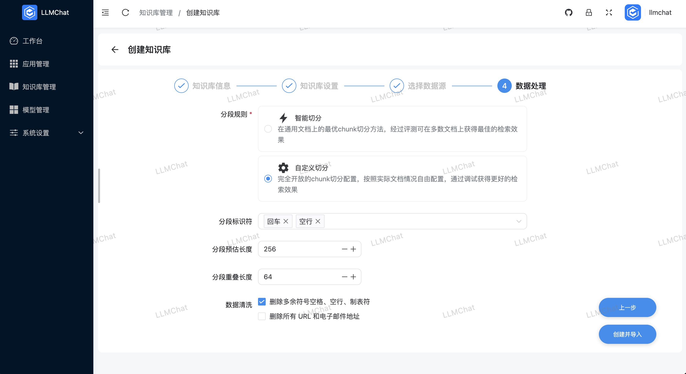
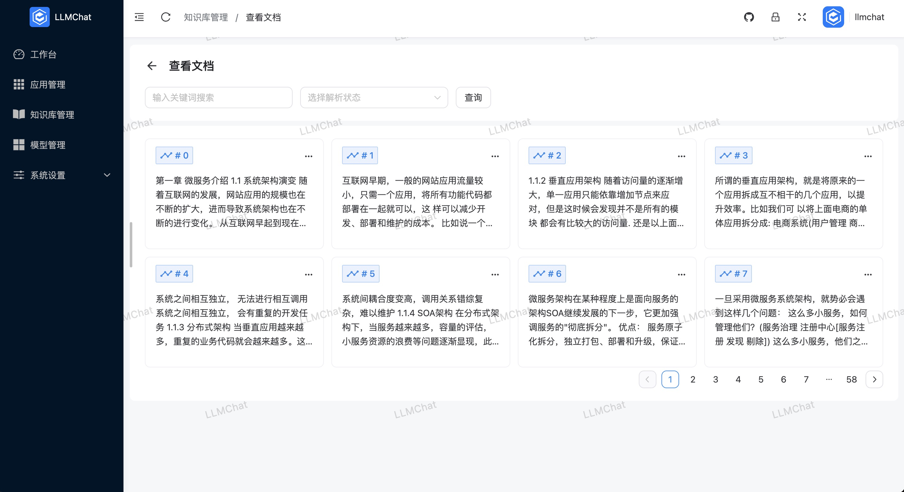
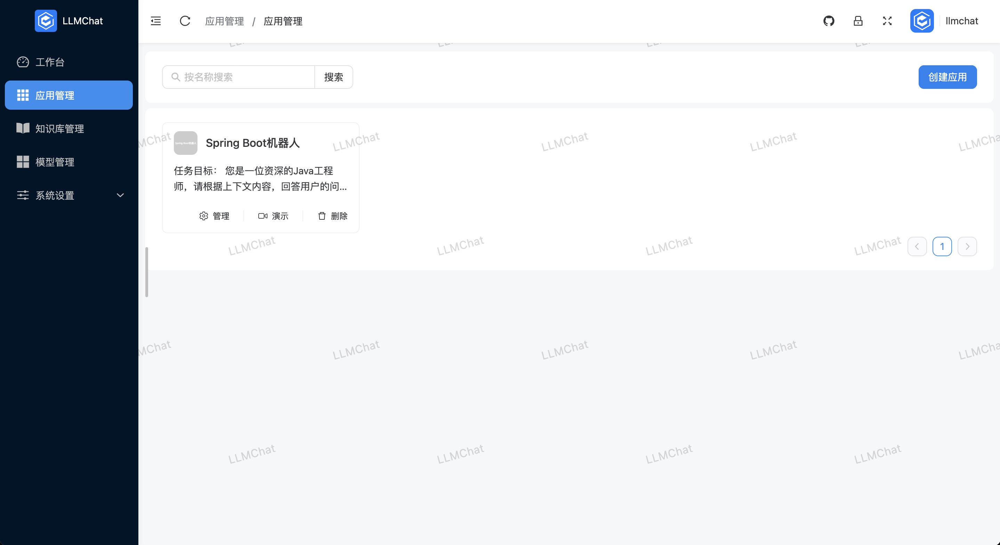
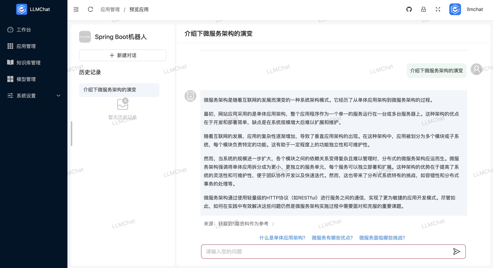

# LLMChat

> 基于LLM、LangChain实现的企业级AIGC项目解决方案

LLMChat是Java生态下企业级AIGC项目解决方案，在RBAC权限体系的基础上，集成AIGC大模型能力，帮助企业快速定制智能客服、AI知识库、AI机器人等。

**本项目完全由本人独立开发，前后端代码工作量庞大，可能存在一些问题，敬请谅解，持续迭代中...**

> **该项目如对您有帮助，欢迎点赞**

代码仓库地址：

- 前端项目：[github](https://github.com/chubin518/llmchat-ui)  [gitee](https://gitee.com/chubin518/llmchat-ui)
- 后端项目：[github](https://github.com/chubin518/llmchat)  [gitee](https://gitee.com/chubin518/llmchat)

## 商业化支持

> 提供一些列商业化服务&技术支持

1. 提供项目部署服务，远程部署到服务器
2. 提供Docker一键部署脚本、提供前后端nginx配置脚本
3. 提供项目架构讲解和AIGC产品设计&技术支持
4. 提供项目二开合作，本项目不可商用，商用请联系作者授权
5. 更多支持...

以上，希望有需要的朋友都可以通过邮箱 **493963286@qq.com** 跟我沟通。

## 特性

1. 模型管理：支持本地私有大模型（LocalAI / Ollama 等）、国内公共大模型（通义千问 / 智谱 AI / 百度千帆
   等）和国外公共大模型（OpenAI / Azure OpenAI等），支持的种类包括大语言模型、向量模型、重排模型等
2. 知识库管理：支持创建、重新向量化、设置、删除等功能，对于知识库文件的分段，目前 LLMChat 支持智能切分以及自定义切分两种方式
3. 应用管理：基于 LLM 大语言模型构建的实际场景应用，支持可视化编排，调试应用信息，无感刷新、所见即所得
4. 提示词：支持一键生成和优化提示词，输出清晰、具体、简洁的优化版本
5. RAG：支持Embedding检索/全文检索/混合检索三种检索模式;每次对话交互后，让 AI 根据之前的对话内容继续生成 3 个提问，引导下一轮对话
6. Function Call：支持定制化Tool工具类，实现本地函数调用，从第三方加载数据并提供给LLM（待完善）
7. 多渠道发布：计划封装Web SDK，将AI智能客服快速嵌入任意第三方Web应用中；计划支持微信、飞书、钉钉等消息通信渠道（待完善）
8. Workflows：计划开发可视化LLM流程设计器，高自定义机器人执行流程（待完善）
9. 提供AIGC客户端应用，快速管理客户端数据（待完善）
10. 更多特性...

## 技术栈

后端技术栈：

* JDK17
* Spring Boot 3.3.4
* [langchain4j(Java version of LangChain)](https://github.com/langchain4j/langchain4j)
* Postgresql
* [Weaviate](https://weaviate.io/developers/weaviate)
* [MinIO](https://min.io/docs/minio/container/index.html)

前端技术栈：

* [Vite](https://vitejs.dev/)
* [Vue3](https://v3.vuejs.org/)
* [TypeScript](https://www.typescriptlang.org/)
* [Es6+](http://es6.ruanyifeng.com/)
* [NaiveUi](https://www.naiveui.com/)

## 版权和协议

Licensed under the GNU License (GPL) v3.

Copyright (c) 2024-present, chubin518.

采用GUN GPL-v3开源协议，可以免费学习使用，个人可以免费是接入使用，商业应用请联系作者授权。

## 版本更新

- 2024.11.15 LLMChat正式发布、公开仓库
- ...

## 预览

## 联系方式

- 邮箱: 493963286@qq.com