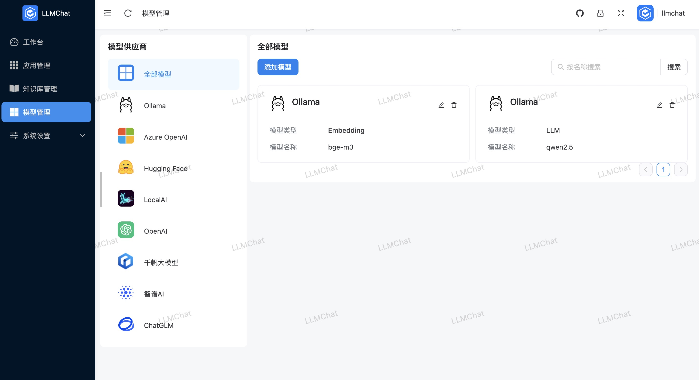
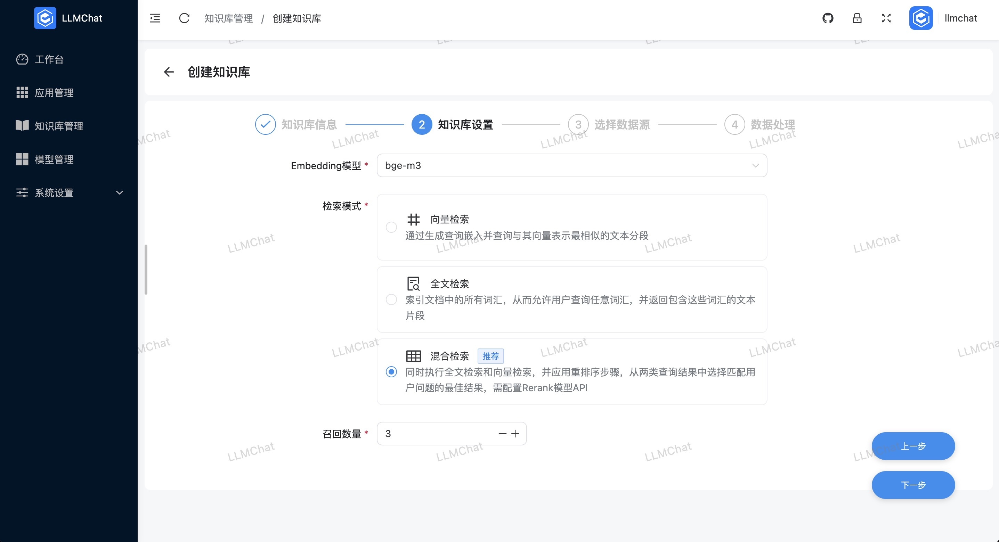
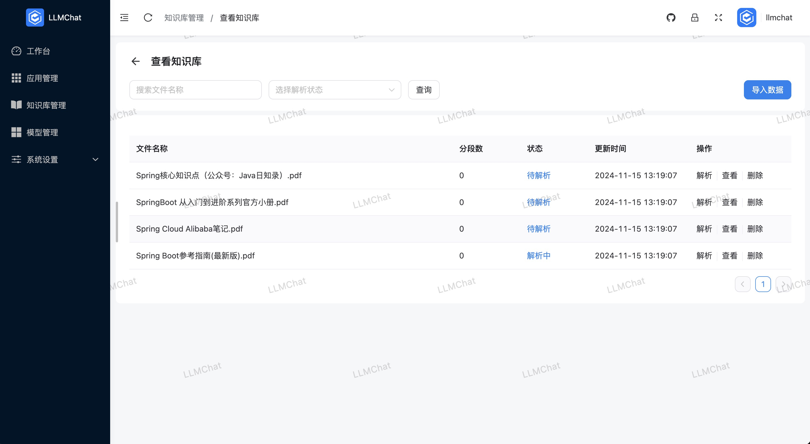
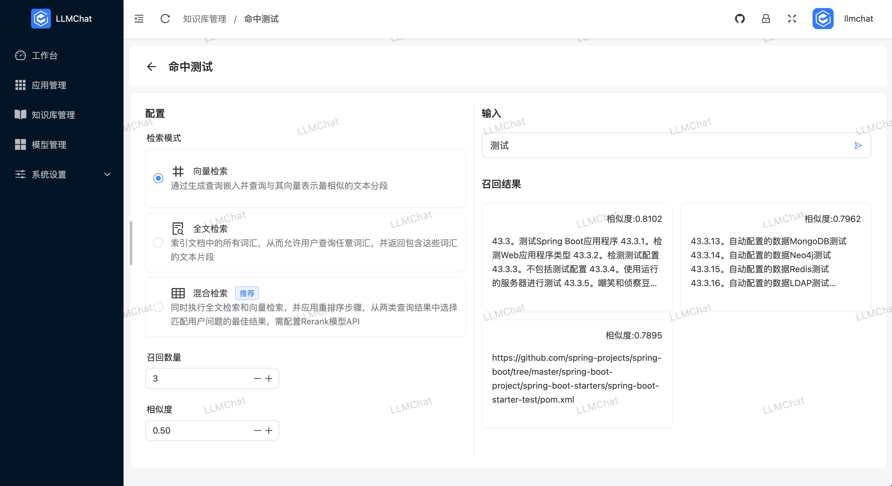

# LLMChat

> 基于LLM和LangChain的企业级AIGC项目解决方案

LLMChat 是一个在Java生态下构建的企业级AIGC项目解决方案。它集成了强大的大语言模型（LLM）功能，结合RBAC权限体系，帮助企业快速构建智能客服、AI知识库、AI机器人等应用场景。

**该项目由开发者独立开发，包含大量前后端代码，可能存在一些待优化之处，敬请谅解。项目持续更新中...**

代码仓库地址：

- 前端项目：[GitHub](https://github.com/chubin518/llmchat-ui) ｜ [Gitee](https://gitee.com/chubin518/llmchat-ui)
- 后端项目：[GitHub](https://github.com/chubin518/llmchat) ｜ [Gitee](https://gitee.com/chubin518/llmchat)

> 如果该项目对您有帮助，欢迎点赞支持！

## 商业化支持

> 本项目提供多种商业化支持服务，具体包括：

1. 项目部署服务，远程部署至服务器。
2. Docker一键部署脚本及前后端Nginx配置脚本。
3. 项目架构讲解，AIGC产品设计及技术支持。
4. 项目二次开发合作（需商用授权）。
5. 其他相关服务需求。

如有需要，请通过邮箱 **493963286@qq.com** 联系。

## 功能特点

1. **模型管理**：支持本地私有大模型（如LocalAI/Ollama）、国内公共大模型（如通义千问/智谱AI/百度千帆）、国际公共大模型（如OpenAI/Azure OpenAI），涵盖大语言模型、向量模型、重排模型等多种模型类型。
2. **知识库管理**：支持创建、重新向量化、设置和删除知识库，分段模式支持智能和自定义切分。
3. **应用管理**：构建基于LLM的大语言模型应用，支持可视化编排、调试和实时刷新，所见即所得。
4. **提示词生成**：一键生成和优化提示词，确保输出简洁、清晰、具体。
5. **RAG（检索增强生成）**：支持Embedding检索、全文检索、混合检索；每次对话后，自动生成3个引导问题，推进对话。
6. **Function Call**：支持自定义工具调用本地函数和第三方数据，计划进一步完善。
7. **多渠道发布**：计划支持Web SDK嵌入至任意Web应用，并扩展到微信、飞书、钉钉等消息平台（开发中）。
8. **Workflows**：计划开发可视化LLM流程设计器，实现高度自定义的机器人流程（开发中）。
9. **AIGC客户端应用**：快速管理客户端数据（开发中）。
10. **更多特性**...
## 技术栈

### 后端

- JDK17
- Spring Boot 3.3.4
- [langchain4j (Java版LangChain)](https://github.com/langchain4j/langchain4j)
- PostgreSQL
- [Weaviate](https://weaviate.io/developers/weaviate)
- [MinIO](https://min.io/docs/minio/container/index.html)

### 前端

- [Vite](https://vitejs.dev/)
- [Vue3](https://v3.vuejs.org/)
- [TypeScript](https://www.typescriptlang.org/)
- [ES6+](http://es6.ruanyifeng.com/)
- [Naive UI](https://www.naiveui.com/)

## 开源协议

本项目遵循GNU GPL v3协议。个人可免费学习与接入使用，商业应用请联系作者授权。

## 版本更新

- 2024.11.15 LLMChat正式发布、公开仓库
- ...

## 预览截图

以下为项目部分界面预览：

## 联系方式

- 邮箱：493963286@qq.com