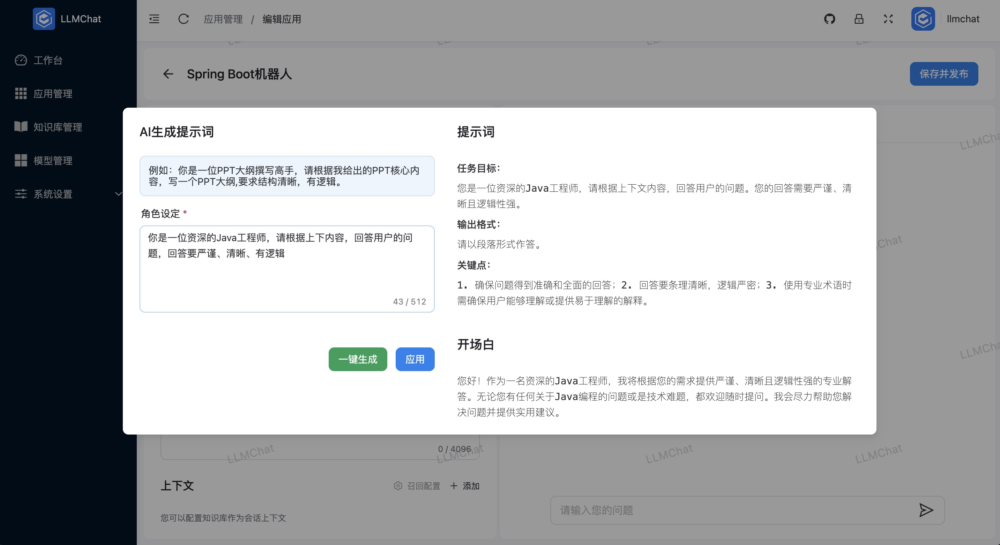

# LLMChat

> **Enterprise-Grade AIGC Project Solution Based on LLM and LangChain**

LLMChat is an enterprise-level AIGC project solution built within the Java ecosystem. It integrates powerful large language model (LLM) capabilities with an RBAC permission system to help businesses quickly create intelligent customer support, AI knowledge bases, AI chatbots, and other applications.

**This project is independently developed by the author and includes a substantial amount of front-end and back-end code. There may be areas requiring optimization, and your understanding is appreciated. The project is continuously updated...**

**Code Repository**:

- Frontend: [GitHub](https://github.com/chubin518/llmchat-ui) | [Gitee](https://gitee.com/chubin518/llmchat-ui)
- Backend: [GitHub](https://github.com/chubin518/llmchat) | [Gitee](https://gitee.com/chubin518/llmchat)

> If this project is helpful to you, a star would be greatly appreciated!

---

## Commercial Support

> Various commercial support services are available for this project, including:

1. Project deployment services, including remote server deployment.
2. Docker one-click deployment scripts and front-end/back-end Nginx configuration scripts.
3. Project architecture explanations, AIGC product design, and technical support.
4. Secondary project development collaboration (requires commercial authorization).
5. Other related service needs.

For inquiries, please contact via email at **alvinlee518@163.com**.

---

## Features

1. **Model Management**: Supports local private models (e.g., LocalAI/Ollama), domestic public models (e.g., Tongyi Qianwen/Zhipu AI/Baidu Qianfan), and international public models (e.g., OpenAI/Azure OpenAI), including language models, vector models, reranking models, and more.
2. **Knowledge Base Management**: Enables creation, re-vectorization, configuration, and deletion of knowledge bases with both intelligent and custom segmentation modes.
3. **Application Management**: Build LLM-based applications with visual orchestration, debugging, and real-time updates for a "what you see is what you get" experience.
4. **Prompt Generation**: Automatically generate and optimize prompts for clear, concise, and specific outputs.
5. **RAG (Retrieval-Augmented Generation)**: Supports embedding retrieval, full-text search, and hybrid search. Automatically generates three follow-up questions after each conversation to enhance interaction.
6. **Function Call**: Custom tool support for local functions and third-party data integration, with ongoing improvements planned.
7. **Multi-Channel Deployment**: Upcoming support for embedding via Web SDK into any web application and integration with platforms like WeChat, Feishu, DingTalk, etc. (in development).
8. **Workflows**: A visual LLM flow designer for creating highly customized bot processes (in development).
9. **AIGC Client Applications**: Quick management of client data (in development).
10. **More Features**...

---

## Tech Stack

### Backend

- JDK17
- Spring Boot 3.3.4
- [langchain4j (Java version of LangChain)](https://github.com/langchain4j/langchain4j)
- PostgreSQL
- Redis 5.0+
- [Weaviate](https://weaviate.io/developers/weaviate)
- [MinIO](https://min.io/docs/minio/container/index.html)

### Frontend

- [Vite](https://vitejs.dev/)
- [Vue3](https://v3.vuejs.org/)
- [TypeScript](https://www.typescriptlang.org/)
- [ES6+](http://es6.ruanyifeng.com/)
- [Naive UI](https://www.naiveui.com/)

---

## License

This project is licensed under the GNU GPL v3. Individuals can use it for free for learning and integration. For commercial applications, please contact the author for authorization.

---

## Changelog

- **2024.11.15**: Official release of LLMChat and public repositories.
- **2024.11.19**: Implementing a message queue based on Redis Stream, with asynchronous user processing of segments and embedding index functionality.
- **2024.12.26**: Upgraded to Langchain 4j, introduced Langchain 4j-Community, updated dependencies for Qianfan, ZhipuAI, DashScope, and ChatGLM, and integrated the local model Xinference.
---

## Preview Screenshots

Below are some screenshots of the project interface:

  
  
  
  
  
  
  
  
  
  
  

---

## Contact Information

- **Email**: alvinlee518@163.com